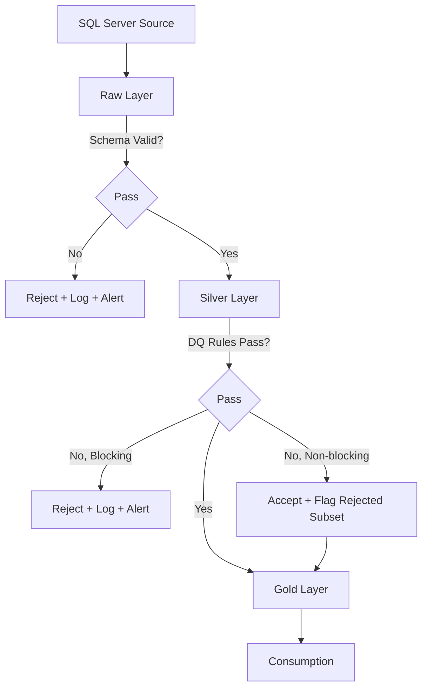

# Medallion Architecture

**Version:** 1.0
**Last Modified:** 2026-07-13
**Depends On:** Project_Architecture.md (v1.0)
**Category:** Architecture

## Purpose
Defines the Medallion (Raw → Silver → Gold) layering pattern in detail — the contract each layer must satisfy, what "done" means for data at each stage, and the rules for promoting data from one layer to the next. `Project_Architecture.md` establishes that this pattern is used; this document defines exactly how it behaves.

## Scope
Covers the structural and behavioral contract of each layer (what goes in, what comes out, what invariant must hold). Does NOT cover the specific processing logic inside each layer (that's `Ingestion_Framework.md`, `Raw_Framework.md`, `Silver_Framework.md`, `Gold_Framework.md`) — this document is the contract those Frameworks must satisfy, not the implementation itself.

## Layer Contracts

### Raw Layer Contract
| Aspect | Rule |
|---|---|
| Purpose | Immutable landing zone for source data, as close to source shape as possible |
| Transformation allowed | None beyond type coercion required for Delta storage, and mandatory audit columns |
| Required audit columns | `_ingested_at`, `_source_system`, `_load_id`, `_watermark_value` |
| Mutability | Append-only for Full/Incremental; append + merge for CDC (see `Ingestion_Framework.md`) |
| Retention | Defined per table in `Source_Config` (`Retention Policy` field) |
| Consumer | Only the Silver layer reads from Raw. No direct Gold-from-Raw reads permitted. |

### Silver Layer Contract
| Aspect | Rule |
|---|---|
| Purpose | Business-conformed, validated, deduplicated data — "the latest valid record" |
| Transformation allowed | Cleansing, null handling, type casting, deduplication, business rule validation, SCD Type 2 history tracking |
| Required audit columns | `_processed_at`, `_is_current` (for SCD2), `_effective_date`, `_expiry_date`, `_version` |
| Mutability | Merge-based (upsert); history preserved via SCD2 where configured |
| Consumer | Only the Gold layer reads from Silver for dimension/fact building. Ad hoc analytics reads are permitted but not the primary contract. |

### Gold Layer Contract
| Aspect | Rule |
|---|---|
| Purpose | Consumption-ready dimensions, facts, and aggregates |
| Transformation allowed | Surrogate key generation, dimensional modeling, aggregation, business logic joins |
| Required audit columns | `_created_at`, `_updated_at`, `_source_pipeline_id` |
| Mutability | Merge-based for dimensions (SCD as configured); append/merge for facts depending on grain |
| Consumer | BI tools, reporting layers, downstream consumers. This is the only layer external tools should query directly. |

## Layer Promotion Rules (Decision Table)

| From → To | Promotion Trigger | Blocking Condition |
|---|---|---|
| Raw → Silver | Raw load marked `SUCCESS` in Logging_Framework | Schema validation failure halts promotion |
| Silver → Gold | Silver load marked `SUCCESS`, all DQ rules passed | Any `DQ_Rules` failure with severity `BLOCKING` halts promotion (see `Data_Quality_Framework.md`) |
| Any layer → next | N/A | `Active Flag = false` in config halts all processing for that table |

## Flow Diagram



## Metadata Driving Layer Behavior

| Config Field | Layer Affected | Effect |
|---|---|---|
| `Load Type` | Raw | Determines Full/Incremental/CDC ingestion path |
| `SCD Type` | Silver | Determines whether history is tracked (Type 2) or overwritten (Type 1) |
| `DQ Rules` | Silver | Determines which validation rules run before promotion |
| `Fact or Dimension` | Gold | Determines which Gold Component (Dimension_Component vs Fact_Component) processes the table |
| `Retention Policy` | Raw | Determines how long raw data is kept before archival/deletion |

## Best Practices
- Never allow a layer to skip its contract even for "simple" tables — consistency across all tables is what makes the framework metadata-driven and AI-generatable. A one-off exception becomes a hardcoded special case.
- Rejected records must always be captured somewhere queryable (a `_rejected` table or column flag), never silently dropped.

## Validation Rules
- No Gold object may be built directly from Raw data. It must pass through Silver's contract first.
- No layer may write without its full set of required audit columns present.

## Pseudo Logic
```
FUNCTION promote_layer(table_config):
    IF NOT table_config.active_flag:
        SKIP and LOG "inactive"
    RUN current_layer_processing(table_config)
    IF validation_passed:
        MARK layer_status = SUCCESS
        TRIGGER next_layer(table_config)
    ELSE:
        MARK layer_status = FAILED
        LOG rejection_reason
        INVOKE Error_Handling_Framework
```

## Acceptance Criteria
- [ ] Every layer's contract table (required audit columns, mutability rule) is respected in every downstream Framework doc.
- [ ] Promotion rules are testable — i.e., an agent generating orchestration code can implement the blocking conditions exactly as written.
- [ ] Flow diagram matches the diagram in `Project_Architecture.md` at the system level (this one just adds the validation/rejection branches).

## Example Metadata
```
table_name: Orders
load_type: CDC
scd_type: 2
dq_rules: [null_check_order_id, positive_amount_check]
fact_or_dimension: Fact
retention_policy: 90_days
```

## Dependencies
- `Project_Architecture.md` (v1.0) — establishes that Medallion is the chosen pattern; this doc defines its contract in detail.

## Future Extension Points
- A "Bronze-plus" or staging sub-layer could be introduced between Raw and Silver if heavy pre-cleansing needs arise for specific sources — would require a contract addition here.

## AI Generation Notes
Any agent generating Raw, Silver, or Gold notebooks must validate its output against the layer contract tables above before considering the notebook complete. If a generated notebook is missing a required audit column, that is a spec compliance failure, not a stylistic choice.