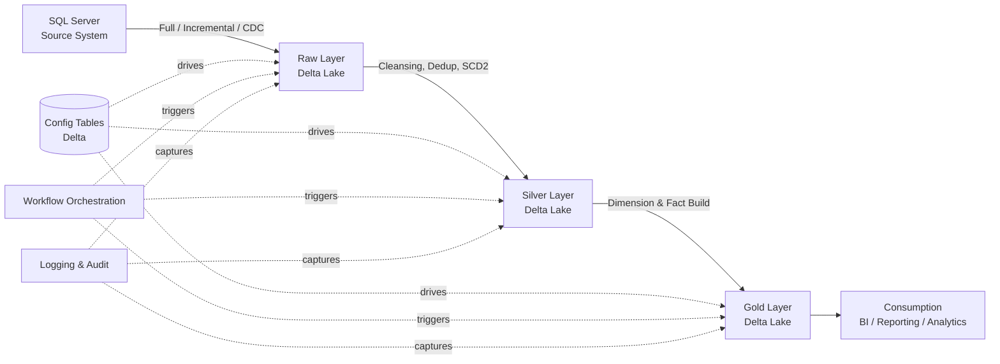

# Project Architecture

**Version:** 1.0
**Last Modified:** 2026-07-13
**Depends On:** None (foundational document)
**Category:** Architecture

## Purpose
Defines the overall system architecture for the ETL framework: what layers exist, how data flows between them, which technologies are used at each stage, and where control/config information lives. This is the single top-level reference every other spec file should align with.

## Scope
Covers the end-to-end system view — source to consumption. Does NOT cover internal logic of any individual layer (that belongs in the respective Framework docs), and does NOT cover specific table schemas (that belongs in config/metadata, per our earlier agreement).

## System Overview

**Source System:** SQL Server
**Destination Platform:** Azure Databricks
**Storage Layer:** Delta Lake
**Architectural Pattern:** Medallion Architecture (Raw → Silver → Gold)
**Orchestration:** Databricks Workflows (Jobs)
**Compute Model:** Serverless (per current environment — see `Deployment/CICD_Pipeline_Deployment.md` for environment-specific notes)

## High-Level Data Flow



## Layer Responsibilities (Decision Table)

| Layer | Responsibility | Data Shape | Driven By |
|---|---|---|---|
| Raw | Land source data as-is, minimal transformation | Matches source schema + audit columns | `Source_Config`, `Pipeline_Config` |
| Silver | Clean, deduplicate, standardize, apply SCD Type 2 where required | Business-conformed, latest valid record + history | `Silver_Framework.md` rules, `Validation_Config` |
| Gold | Build dimensions, facts, aggregates for consumption | Star/snowflake schema | `Gold_Framework.md` rules, `Dimension`/`Fact` config |

## Core Architectural Principles

| Principle | Rule |
|---|---|
| Metadata-driven | No hardcoded table names, notebook names, or workflow names anywhere in generated code. Everything resolves from config tables. |
| Single Responsibility per Notebook | Each notebook does exactly one job (e.g., "Load Customer," "Clean Product") — never combined. |
| Idempotency | Every layer's write operation must be safely re-runnable without creating duplicates or corrupting state. |
| Auditability | Every load must be traceable: source count, target count, rejected count, watermark, execution time. |
| Separation of Runtime vs. Design-Time Metadata | Config tables (Delta) drive execution at runtime. Specs (Markdown) drive code generation at design time. These are never the same artifact. |

## Where Things Live

| Concern | Location | Type |
|---|---|---|
| Architecture, rules, standards | `/specs/` | Markdown (static, version-controlled) |
| What tables exist, their load type, keys, schedule | Delta config tables (e.g., `Source_Config`) | Runtime data |
| Actual notebooks, SQL, workflow definitions | Databricks workspace (synced via Git/Repos) | Generated code |
| Dependency tracking between specs | `Governance/Dependency_Manifest.md` | Markdown |

## Example (Illustrative Only — Not a Real Table)

```
Source Table:        Orders
Load Type:           CDC
Target Raw Table:    raw_orders
Target Silver Table: silver_orders
SCD Type:            2
Gold Object:         fact_sales (via Fact_Component)
Workflow Group:      Sales
```

## Best Practices
- Treat this document as the "map" — if a future spec seems to contradict the flow described here, the flow in this document wins unless this document itself is formally revised (see `Governance/Spec_Versioning.md`).
- Any new layer, technology, or major architectural shift (e.g., adding a streaming ingestion path) must be reflected here first, before any Framework or Component spec references it.

## Validation Rules
- No Framework or Component spec may introduce a data flow path not represented in the Mermaid diagram above.
- No spec may hardcode a source system other than SQL Server, or a destination other than Databricks/Delta Lake, without this document being updated first.

## Pseudo Logic (System-Level)
```
FOR each active entry in Source_Config:
    DETERMINE load_type (Full / Incremental / CDC)
    TRIGGER Raw ingestion (per Ingestion_Framework.md)
    ON SUCCESS → TRIGGER Silver processing (per Silver_Framework.md)
    ON SUCCESS → TRIGGER Gold processing (per Gold_Framework.md)
    LOG every stage (per Logging_Framework.md)
    AUDIT every stage (per Audit_Framework.md)
    ON FAILURE at any stage → invoke Error_Handling_Framework.md
```

## Generation Rules
- AI agents generating code from downstream specs must always be able to trace their output back to a layer defined in this document.
- No agent may generate a notebook, table, or workflow that doesn't map to Raw, Silver, or Gold as defined here.

## Acceptance Criteria
- [ ] Diagram accurately reflects source, layers, and consumption points.
- [ ] Every downstream Framework doc references this file as a dependency.
- [ ] No layer responsibility overlaps with another (e.g., Raw doesn't do cleansing; that's Silver's job).

## Dependencies
None. This is a root-level document, alongside `Dependency_Manifest.md`.

## Future Extension Points
- Adding a streaming/near-real-time ingestion path (e.g., via Structured Streaming or Delta Live Tables) would extend this diagram with a parallel path alongside CDC.
- Adding a second source system type (not just SQL Server) would require this doc to introduce a source-abstraction layer — see the genericity discussion in project notes.

## AI Generation Notes
This file is the anchor document. Any AI agent building or validating other specs should read this file first, before reading any Framework or Component doc, to establish overall system context.