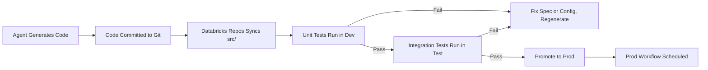

# Deployment Strategy

**Version:** 1.0
**Last Modified:** 2026-07-13
**Depends On:** Project_Architecture.md (v1.0), Repository_Structure.md (v1.0), Testing_Strategy.md (v1.0), Coding_Standards.md (v1.0)
**Category:** Deployment

## Purpose
Defines how generated code moves from Git to a running Databricks environment — environment separation, the CI/CD flow, and rollback procedures. Scoped to Databricks Free Edition's single-workspace constraint.

## Scope
Covers deployment pipeline and environment management. Does NOT cover secrets handling (that's `Secrets_Management.md`) and does NOT cover what code is generated (that's the agents/specs).

---

## Environment Separation

Databricks Free Edition provides one workspace. Multi-environment separation (dev/test/prod) is achieved logically, not physically:

| Environment | Implementation | Purpose |
|---|---|---|
| Dev | Separate catalog/schema prefix: `dev_` | Agent-generated code is tested here first |
| Test | Separate catalog/schema prefix: `test_` | Integration tests run here, per `Testing_Strategy.md` |
| Prod | No prefix (default catalog/schema) | Only code that passes all tests reaches here |

All three environments share the same workspace, the same compute, and the same Git repo — only the catalog/schema target differs, controlled by a single environment parameter passed to every notebook at runtime.

### Environment Parameter
Every generated notebook must accept an `environment` parameter (e.g., `dev`, `test`, `prod`) that determines which catalog/schema it reads from and writes to. This parameter is never hardcoded — it's supplied by the workflow job at trigger time.

---

## CI/CD Pipeline Flow

### Step Details

| Step | What Happens | Who/What Triggers It |
|---|---|---|
| 1. Code generation | Agent reads specs + config, generates notebooks/SQL/workflows into `src/` | Developer runs agent manually or via orchestrator_agent |
| 2. Git commit | Generated code committed to the repo | Developer reviews and commits |
| 3. Databricks Repos sync | Databricks workspace pulls latest `src/` from Git | Manual sync or automatic on commit (if configured) |
| 4. Unit tests (Dev) | All unit tests run against `dev_` schema | Triggered manually or via a CI workflow |
| 5. Integration tests (Test) | Full pipeline test against `test_` schema with sample data | Triggered after unit tests pass |
| 6. Promotion to Prod | Notebooks and workflows are pointed at prod schema | Environment parameter changed from `test` to `prod` in the workflow config |
| 7. Prod scheduling | Workflow jobs run on their configured `schedule` | Databricks Workflows scheduler |

### What "Promotion" Actually Means
There is no separate deployment step for prod — the same notebooks, same Git commit, same Databricks Repos sync serve all environments. "Promoting to prod" means:
1. The workflow job's `environment` parameter is set to `prod`.
2. Config tables in the prod schema are populated with real table entries.
3. The workflow schedule is enabled.

No code changes between test and prod — only the parameter changes. This is the payoff of the config-driven architecture.

---

## Rollback Strategy

| Scenario | Rollback Method |
|---|---|
| Bad code deployed (generated notebooks have a bug) | Revert the Git commit, re-sync Databricks Repos — notebooks instantly revert to the prior version |
| Bad config deployed (wrong config values in prod) | Update config table entries directly — no code revert needed, since code reads config at runtime |
| Bad data written (pipeline ran correctly but source data was wrong) | Use Delta Time Travel (`RESTORE TABLE AS OF VERSION`) to revert affected Delta tables to their pre-run state |
| Workflow misconfigured (wrong schedule, wrong dependency order) | Update `Workflow_Config` entries — workflow definitions are config-driven, not hardcoded |

### Delta Time Travel as the Safety Net
Because every layer uses Delta Lake, every write is versioned automatically. A rollback is always possible by restoring a table to a prior version — bounded only by the `retention_policy` configured per table in `Pipeline_Config`. This is the strongest rollback guarantee in the framework and requires zero custom rollback code.

---

## Acceptance Criteria
- [ ] Every generated notebook accepts an `environment` parameter and never hardcodes a catalog/schema.
- [ ] No code changes are required between test and prod — only the environment parameter differs.
- [ ] Unit tests must pass before integration tests run; integration tests must pass before prod promotion.
- [ ] Rollback is achievable within minutes via Git revert (code), config update (config), or Delta Time Travel (data).

## Dependencies
- `Project_Architecture.md` (v1.0) — establishes Databricks + Delta as the platform.
- `Repository_Structure.md` (v1.0) — `src/` folder is what gets synced to Databricks Repos.
- `Testing_Strategy.md` (v1.0) — unit and integration tests are prerequisites to promotion.
- `Coding_Standards.md` (v1.0) — generated code must follow standards before it's eligible for deployment.

## Future Extension Points
- If you upgrade beyond Free Edition to a multi-workspace Databricks plan, logical separation (schema prefixes) can be replaced with physical workspace separation — the `environment` parameter pattern still works, it would just resolve to different workspace URLs instead of different schema prefixes.
- Could add automated CI triggers (run tests on every Git push) if the development pace justifies it.

## AI Generation Notes
Every agent generating notebooks must parameterize the environment — no agent may generate a notebook that writes to a fixed catalog/schema. The `deployment_agent` is responsible for generating workflow definitions that pass the correct `environment` parameter, per this document.