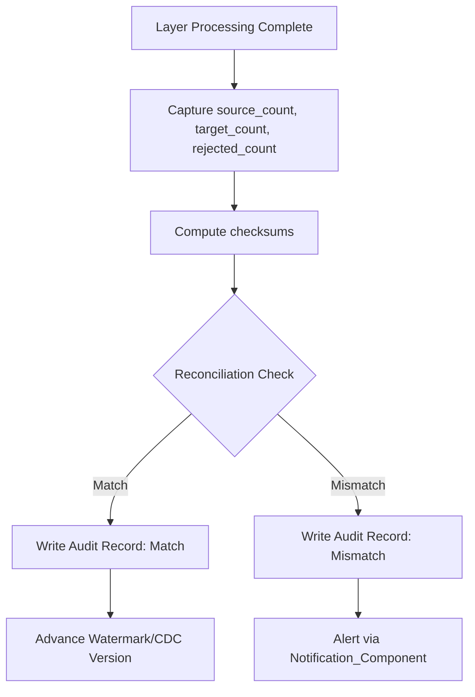

# Audit Framework

**Version:** 1.0
**Last Modified:** 2026-07-13
**Depends On:** Project_Architecture.md (v1.0), Config_Framework.md (v1.0), Ingestion_Framework.md (v1.0), Raw_Framework.md (v1.0), Silver_Framework.md (v1.0), Gold_Framework.md (v1.0), Logging_Framework.md (v1.0)
**Category:** Frameworks

## Purpose
Defines how data integrity is verified and tracked across every layer — reconciling source counts against target counts, tracking checksums, and maintaining watermark/CDC version state. Where `Logging_Framework.md` answers "what happened and how long did it take," this framework answers "did all the data actually arrive correctly."

## Scope
Covers reconciliation logic and integrity tracking. Does NOT duplicate operational logging (timing, status, step-by-step detail) — that remains in `Logging_Framework.md`. The two frameworks share some fields (e.g., `pipeline_id`) but serve distinct purposes and are consumed independently.

## Audit Table Schema

| Field | Type | Description |
|---|---|---|
| `pipeline_id` | string | Links to the overall run, shared with Logging Framework |
| `workflow_id` | string | Links to the workflow run |
| `notebook_id` | string | Links to the specific notebook |
| `table_name` | string | Table being audited |
| `layer` | enum(Raw, Silver, Gold) | Which layer this audit record applies to |
| `source_count` | integer | Row count read from source (or from previous layer, for Silver/Gold audits) |
| `target_count` | integer | Row count written to target |
| `rejected_count` | integer | Row count rejected during processing |
| `checksum_source` | string | Hash of source data (e.g., hash of key columns/aggregated values) |
| `checksum_target` | string | Hash of target data, for comparison |
| `watermark_value` | string, nullable | Watermark value used/advanced during this run |
| `cdc_version` | string, nullable | CDC version/LSN used/advanced during this run |
| `execution_time_seconds` | integer | Total time for this layer's processing |
| `reconciliation_status` | enum(Match, Mismatch, NotApplicable) | Result of count/checksum comparison |

## Reconciliation Rules (Decision Table)

| Check | Rule | On Failure |
|---|---|---|
| `source_count == target_count + rejected_count` | Every source row must be accounted for — either written or explicitly rejected | Flag `reconciliation_status = Mismatch`, alert |
| `checksum_source == checksum_target` (where applicable) | Confirms no silent data corruption between layers | Flag `reconciliation_status = Mismatch`, alert |
| Watermark/CDC version advanced only after successful write | Prevents data loss on retry (see `Ingestion_Framework.md`) | N/A — enforced structurally, not reconciled after the fact |

Note: exact count equality doesn't apply uniformly across all layers — e.g., deduplication in Silver legitimately reduces row counts. The reconciliation rule for Silver/Gold is adapted: `source_count == target_count + rejected_count + deduplicated_count`, where `deduplicated_count` is explicitly tracked, not just absorbed into the gap.

## Per-Layer Audit Points

| Layer | What Gets Audited |
|---|---|
| Raw | Source row count vs. Raw row count written; watermark/CDC version before and after |
| Silver | Raw row count vs. Silver accepted + rejected + deduplicated count |
| Gold | Silver row count vs. Gold dimension/fact row count (accounting for aggregation grain changes, which are expected and not a mismatch) |

## Flow Diagram



## Best Practices
- Compute checksums on a meaningful subset (key columns or aggregated numeric measures) rather than entire row content — full-row hashing is expensive and often unnecessary for reconciliation purposes.
- Treat `Mismatch` status as a signal for investigation, not automatically as a pipeline-halting failure — some mismatches (e.g., expected deduplication) are legitimate and should be explicitly modeled rather than treated as errors, per the reconciliation rule adjustment above.

## Validation Rules
- Every layer run must produce exactly one audit record — never skipped, even on failure (a failed run should audit what did complete before failing).
- Watermark/CDC version fields in the audit record must match exactly what was used for that run — no discrepancy between audit record and actual advanced state.

## Pseudo Logic
```
FUNCTION audit_layer(table_config, layer, source_count, target_count, rejected_count, dedup_count=0):
    expected_target = source_count - rejected_count - dedup_count
    status = "Match" IF target_count == expected_target ELSE "Mismatch"

    WRITE audit_record(
        table_name=table_config.table_name,
        layer=layer,
        source_count=source_count,
        target_count=target_count,
        rejected_count=rejected_count,
        reconciliation_status=status
    )

    IF status == "Mismatch":
        ALERT(table_config.table_name, layer, details)
```

## Acceptance Criteria
- [ ] Every layer produces an audit record with accurate counts.
- [ ] Reconciliation logic correctly accounts for legitimate row-count changes (dedup, aggregation) rather than flagging them as false mismatches.
- [ ] Watermark/CDC version tracking in audit matches the actual runtime state exactly.

## Example (Illustrative Only)

```
table_name: Orders
layer: Silver
source_count: 15234
target_count: 15186
rejected_count: 3
dedup_count: 45
reconciliation_status: Match   # 15234 - 3 - 45 = 15186 ✓
```

## Dependencies
- `Config_Framework.md` (v1.0) — `table_name`, layer identifiers trace back to config.
- `Ingestion_Framework.md`, `Raw_Framework.md`, `Silver_Framework.md`, `Gold_Framework.md` (all v1.0) — each supplies the counts this framework reconciles.
- `Logging_Framework.md` (v1.0) — shares `pipeline_id`/`workflow_id`/`notebook_id` fields for cross-referencing, but audit records are a distinct table from logs.

## Future Extension Points
- Could add automated daily audit summary reports across all tables, surfacing any `Mismatch` records from the prior 24 hours.
- Could extend checksum comparison to support column-level drift detection (which specific columns changed unexpectedly), beyond just row-count reconciliation.

## AI Generation Notes
Any agent generating layer-processing notebooks must call the shared `Audit_Component` at the end of each layer's processing, passing accurate counts (including any dedup/rejection counts) — never approximate or omit these values, since downstream reconciliation depends on their accuracy.