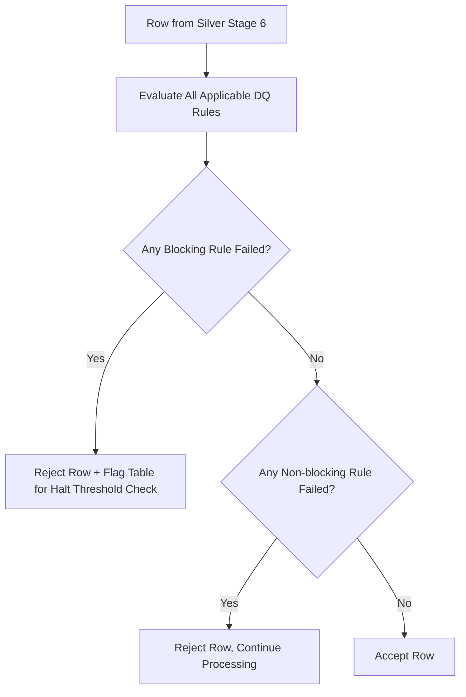

# Data Quality Framework

**Version:** 1.0
**Last Modified:** 2026-07-13
**Depends On:** Project_Architecture.md (v1.0), Config_Framework.md (v1.0), Silver_Framework.md (v1.0), Audit_Framework.md (v1.0)
**Category:** Frameworks

## Purpose
Defines the full data quality rule model — rule types, severity levels, and how rules are declared, evaluated, and enforced. This document is also where we formally resolve an open gap: `Config_Framework.md` originally declared `dq_rules` as a flat array of strings, but `Silver_Framework.md` requires each rule to carry a severity (blocking/non-blocking). This document defines the corrected structure; `Config_Framework.md` should be amended to match (see Amendment Note below).

## Scope
Covers rule types, structure, and evaluation logic for both `validation_rules` and `dq_rules`. Does NOT cover where rejected rows are routed (that's `Silver_Framework.md`) — this document defines what a rule *is* and how it's *evaluated*, not what happens after.

## Rule Categories

| Category | Examples | Where Applied |
|---|---|---|
| Null Checks | Column must not be null | Silver stage 2 (Null Handling) and/or DQ stage |
| Type Validation | Column must be castable to expected type | Silver stage 3 (Type Casting) |
| Duplicate Checks | No duplicate business key within a batch | Silver stage 4 (Deduplication) |
| Range/Value Checks | Numeric value within expected bounds (e.g., `amount > 0`) | DQ stage (stage 7) |
| Referential Checks | Foreign-key-style value exists in a reference set | DQ stage, or Gold dimension key resolution |
| Business Logic Checks | Table-specific rule (e.g., `ship_date >= order_date`) | DQ stage |

## Rule Structure

```yaml
rule_name: string                     # unique identifier, e.g., "positive_amount_check"
rule_type: enum(null_check, type_check, duplicate_check, range_check, referential_check, business_logic)
severity: enum(blocking, non_blocking)
target_column: string, optional       # column this rule applies to, if single-column
expression: string                    # the actual check logic, e.g., "amount > 0"
parameters: object, optional          # any thresholds or reference values needed
```

## Severity Behavior (Decision Table)

| Severity | Row Fails Rule | Table-Level Effect |
|---|---|---|
| `blocking` | Row is rejected AND if failure rate exceeds a configured threshold (or by default, any occurrence), the entire table processing halts | Halt entire pipeline for this table, per `Error_Handling_Framework.md` |
| `non_blocking` | Row is rejected, routed to rejected records | Table processing continues normally with remaining rows |

## Rule Evaluation Order
1. Null Checks
2. Type Validation
3. Duplicate Checks
4. Range/Value Checks
5. Referential Checks
6. Business Logic Checks

Rules within the same category run independently (a row can fail multiple rules simultaneously); all applicable rule results are captured before the row is finally classified accepted/rejected.

## Flow Diagram



## Best Practices
- Keep rule expressions declarative and simple (e.g., `amount > 0`) so they can be evaluated generically by a rule engine, rather than requiring custom code per rule — this is what keeps DQ rules config-driven rather than hardcoded.
- Default new rules to `non_blocking` unless there's a clear reason data integrity requires halting — overusing `blocking` severity makes the pipeline fragile.

## Validation Rules
- Every rule declared in `Validation_Config.dq_rules` must have both `rule_name` and `severity` populated — no rule may be evaluated without an explicit severity.
- A `blocking` rule with no defined halt-threshold defaults to "any single failure halts the table" — this must be explicit in documentation for each table, not assumed silently.

## Pseudo Logic
```
FUNCTION evaluate_dq_rules(row, rules):
    failed_blocking = []
    failed_non_blocking = []

    FOR each rule in rules (in evaluation order):
        result = EVALUATE(rule.expression, row)
        IF NOT result:
            IF rule.severity == "blocking":
                failed_blocking.append(rule.rule_name)
            ELSE:
                failed_non_blocking.append(rule.rule_name)

    IF failed_blocking.is_not_empty:
        RETURN REJECT(row, reason=failed_blocking, halts_table=True)
    IF failed_non_blocking.is_not_empty:
        RETURN REJECT(row, reason=failed_non_blocking, halts_table=False)
    RETURN ACCEPT(row)
```

## Acceptance Criteria
- [ ] Every DQ rule has a defined severity — no ambiguous defaults slip through.
- [ ] Blocking vs. non-blocking behavior is deterministic and matches `Silver_Framework.md`'s stage 7 expectations.
- [ ] `Config_Framework.md` amendment is tracked and applied (see Amendment Note).

## Example Metadata (Illustrative Only)

```yaml
dq_rules:
  - rule_name: positive_amount_check
    rule_type: range_check
    severity: blocking
    target_column: amount
    expression: "amount > 0"
  - rule_name: valid_country_code
    rule_type: referential_check
    severity: non_blocking
    target_column: country_code
    expression: "country_code IN (reference_country_list)"
```

## Dependencies
- `Config_Framework.md` (v1.0) — `dq_rules` structure defined in both this document and `Config_Framework.md` (already aligned).
- `Silver_Framework.md` (v1.0) — DQ rules are evaluated at stage 7 of Silver processing.
- `Audit_Framework.md` (v1.0) — rejected counts from DQ rule failures feed into audit reconciliation.

## Future Extension Points
- Could add a configurable failure-rate threshold for blocking rules (e.g., "halt only if more than 5% of rows fail this blocking rule," rather than any single failure) if pipelines need more tolerance.
- Could support cross-table DQ rules (e.g., referential integrity checks against another table's Silver data) as a future rule category.

## AI Generation Notes
Any agent generating DQ evaluation code must implement severity-based branching exactly as described, and must treat the Amendment Note as authoritative — meaning generated config-table DDL for `Validation_Config.dq_rules` should use the object structure defined here, not the original flat-string version from `Config_Framework.md` v1.0.