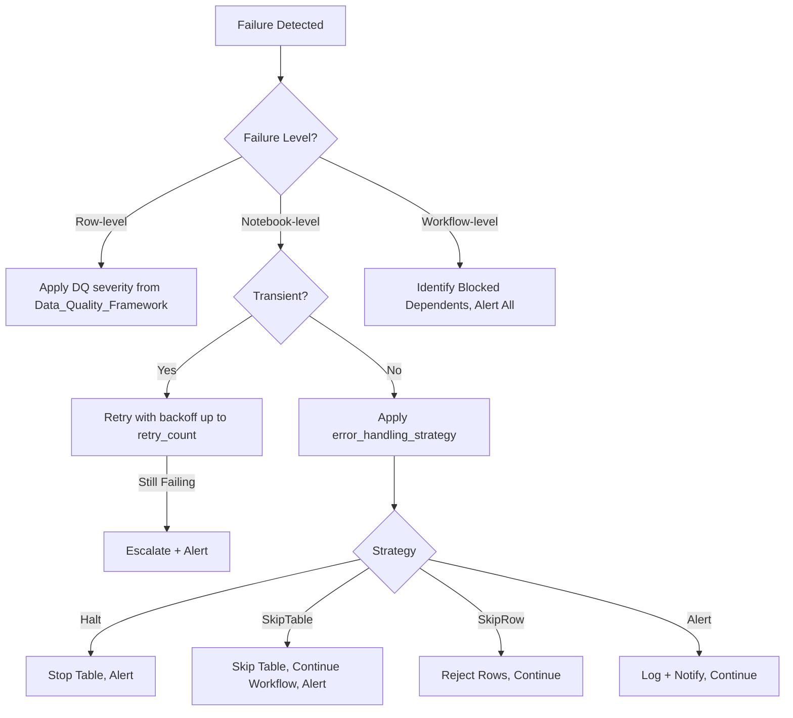

# Error Handling Framework

**Version:** 1.0
**Last Modified:** 2026-07-13
**Depends On:** Project_Architecture.md (v1.0), Config_Framework.md (v1.0), Data_Quality_Framework.md (v1.0), Logging_Framework.md (v1.0), Audit_Framework.md (v1.0)
**Category:** Frameworks

## Purpose
Defines how the framework responds to failures at every level — row-level DQ failures, notebook-level exceptions, and workflow-level failures. Consolidates the `error_handling_strategy` field from `Config_Framework.md` into concrete, deterministic behavior, and defines retry/escalation rules referenced throughout `Ingestion_Framework.md`, `Silver_Framework.md`, and `Data_Quality_Framework.md`.

## Scope
Covers failure classification, response strategy, retry logic, and escalation/notification triggers. Does NOT cover how errors are logged (that's `Logging_Framework.md` — this document defines *what happens*, Logging defines *how it's recorded*).

## Failure Classification

| Failure Level | Examples | Governed By |
|---|---|---|
| Row-level | A single row fails a DQ or business rule | `Data_Quality_Framework.md` severity model |
| Notebook-level | Schema validation failure, connection failure, unhandled exception | This document |
| Workflow-level | A notebook fails and has dependents that can't proceed | This document + `Workflow_Orchestration_Framework.md` |
| Schema-level | Breaking schema change detected | `Schema_Management_Framework.md` (always Halt, non-configurable) |

## Error Handling Strategy Field (from Config_Framework.md)

| Strategy | Behavior |
|---|---|
| `Halt` | Stop processing this table immediately; do not proceed to next layer; alert |
| `SkipRow` | Reject the offending row(s), continue processing remaining rows in the batch |
| `SkipTable` | Skip this table entirely for the current run, but allow other tables/workflow to continue |
| `Alert` | Log and notify, but do not stop processing (used for informational-severity issues) |

Note: `SkipRow` behavior is effectively equivalent to a `non_blocking` DQ rule failure (per `Data_Quality_Framework.md`) applied at the notebook level rather than per-rule — this strategy governs the *table's* default behavior when an unclassified/unexpected error occurs, distinct from rule-specific severity.

## Retry Logic

| Failure Type | Retryable? | Retry Behavior |
|---|---|---|
| Transient (connection timeout, temporary resource unavailability) | Yes | Retry up to `Workflow_Config.retry_count`, with exponential backoff |
| Schema validation failure | No | Never auto-retried — requires manual review per `Schema_Management_Framework.md` |
| DQ blocking rule failure | No | Never auto-retried — the data itself is the problem, not transient infrastructure |
| Unhandled exception (bug) | Limited | Retry once; if it fails again, escalate rather than retry indefinitely |

## Escalation & Notification Rules

| Condition | Notification Trigger |
|---|---|
| Table `Halt`ed | Immediate alert via `Notification_Component` to configured channel |
| `SkipTable` invoked | Alert, lower urgency than Halt (informational) |
| Retry exhausted (`retry_count` reached) | Immediate alert, escalate as a failure requiring manual intervention |
| Workflow-level cascading failure (dependent tables blocked) | Alert listing all blocked downstream tables, not just the originating failure |

## Flow Diagram



## Best Practices
- Default to `Alert` or `SkipRow` for new tables during onboarding, and tighten to `Halt` only once the pipeline has proven stable — starting with `Halt` everywhere makes early onboarding needlessly fragile.
- Never silently swallow an exception — every failure path must terminate in either a retry, a defined skip/halt action, or an escalation. There is no "do nothing" path.

## Validation Rules
- Every table config must have a non-null `error_handling_strategy` — no table may rely on an implicit default.
- Retry counts must be bounded (`Workflow_Config.retry_count`) — infinite retry loops are not permitted.
- A workflow-level failure must always identify and alert on all downstream dependents blocked by it, not just log the originating failure in isolation.

## Pseudo Logic
```
FUNCTION handle_failure(table_config, failure):
    IF failure.is_transient AND retry_attempts < table_config.retry_count:
        RETRY with backoff
        RETURN

    IF failure.type == "schema_breaking" OR failure.type == "dq_blocking":
        strategy = "Halt"   # non-negotiable per Schema_Management_Framework / Data_Quality_Framework
    ELSE:
        strategy = table_config.error_handling_strategy

    SWITCH strategy:
        CASE "Halt":
            STOP table_config.table_name
            ALERT(urgency=High)
        CASE "SkipTable":
            SKIP table_config.table_name, CONTINUE workflow
            ALERT(urgency=Medium)
        CASE "SkipRow":
            REJECT affected rows, CONTINUE table processing
        CASE "Alert":
            LOG, NOTIFY(urgency=Low), CONTINUE

    IF table_config has downstream dependents:
        IDENTIFY blocked_dependents
        ALERT(blocked_dependents)
```

## Acceptance Criteria
- [ ] Every failure type maps to a deterministic response — no ambiguous "case by case" handling.
- [ ] Retry logic never results in an infinite loop.
- [ ] Every Halt/SkipTable event correctly identifies and alerts on blocked downstream dependents.

## Example (Illustrative Only)

```
table_name: Orders
error_handling_strategy: Halt
Failure: DQ blocking rule "positive_amount_check" failed on 12 rows
Action: Table processing halted. Alert sent. Downstream dependents (fact_sales) flagged as blocked.
```

## Dependencies
- `Config_Framework.md` (v1.0) — reads `error_handling_strategy`, `retry_count` fields.
- `Data_Quality_Framework.md` (v1.0) — row-level severity feeds into this framework's classification.
- `Logging_Framework.md` (v1.0), `Audit_Framework.md` (v1.0) — every failure handled here must also produce corresponding log/audit entries.

## Future Extension Points
- Could add configurable escalation channels per severity (e.g., Slack for Low, PagerDuty for High) once `Notification_Component.md` is built out.
- Could add automatic root-cause classification (distinguishing "data problem" vs. "infrastructure problem" failures) using historical failure pattern analysis.

## AI Generation Notes
Any agent generating error-handling logic in a notebook must implement the strategy switch exactly as described, and must always identify downstream dependents before finalizing a Halt/SkipTable action — omitting the dependent-blocking alert is a spec compliance failure, not a minor omission.