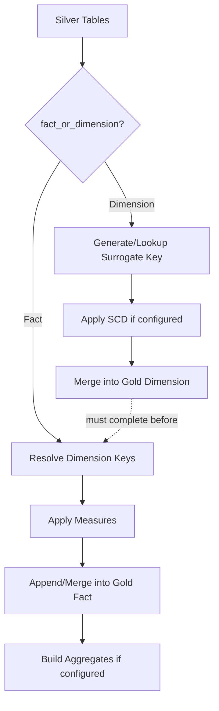

# Gold Framework

**Version:** 1.0
**Last Modified:** 2026-07-13
**Depends On:** Project_Architecture.md (v1.0), Medallion_Architecture.md (v1.0), Config_Framework.md (v1.0), Silver_Framework.md (v1.0), SCD_Type2_Framework.md (v1.0)
**Category:** Frameworks

## Purpose
Defines how Silver data is transformed into consumption-ready Gold objects — dimensions, facts, and aggregates — following star/snowflake schema modeling, fully driven by `Pipeline_Config.fact_or_dimension` and related metadata. This is the final layer before BI/reporting consumption, per the Gold layer contract in `Medallion_Architecture.md`.

## Scope
Covers dimension building, fact building, aggregation, and dependency ordering between Gold objects. Does NOT cover Silver-side cleansing (already done) or BI tool-specific semantics (out of scope for this framework).

## Gold Object Types

| Type | Purpose | Key Characteristic |
|---|---|---|
| Dimension | Descriptive attributes about a business entity (Customer, Product) | Has a surrogate key; may carry SCD Type 2 history |
| Fact | Measurable business events (Sales, Orders) | References dimension surrogate keys via foreign keys; grain must be explicitly defined |
| Aggregate | Pre-computed summaries (e.g., daily sales totals) | Derived from one or more Facts; refreshed incrementally |

## Dimension Building

| Step | Rule |
|---|---|
| 1. Read Silver source | Pull from the Silver table(s) declared for this dimension |
| 2. Generate/lookup surrogate key | Use `Surrogate_Key_Component` — new key for new business keys, reuse existing key for known ones |
| 3. Apply SCD (if configured) | If `scd_type = 2` at Gold layer, apply the same mechanics as `SCD_Type2_Framework.md`, mirrored into the Gold dimension table |
| 4. Merge into Gold dimension table | Upsert using `merge_keys` |

## Fact Building

| Step | Rule |
|---|---|
| 1. Read Silver source | Pull from the Silver transactional table |
| 2. Resolve dimension keys | Look up each referenced dimension's surrogate key using the business key present in the fact row (via `Dimension_Component` lookup) |
| 3. Define grain | Grain (one row = what) must be explicitly documented per fact table — e.g., "one row per order line item" |
| 4. Apply measures | Numeric/business measures carried as-is or computed (e.g., `line_total = quantity * unit_price`) |
| 5. Merge/append into Gold fact table | Append for immutable event facts; merge if facts can be corrected/updated |

## Dimension Key Resolution (Decision Table)

| Scenario | Resolution |
|---|---|
| Business key found in dimension | Use existing surrogate key |
| Business key not found in dimension (late-arriving fact) | Insert a placeholder/"unknown member" dimension row, resolve properly on next dimension refresh |
| Business key is null in source fact | Map to a designated "Not Applicable" dimension row, never leave the foreign key null |

## Aggregation Rules
- Aggregates are always derived, never a primary write target — they must be fully recomputable from Facts + Dimensions at any time.
- Incremental aggregation (updating only affected partitions/groups) is preferred over full recompute where the fact table is large — determined per aggregate based on its `partition_columns`.

## Dependency Management Between Gold Objects

| Rule | Reason |
|---|---|
| Dimensions must be refreshed before the Facts that reference them | Ensures dimension key resolution has up-to-date data to look up against |
| Facts must be refreshed before Aggregates built on them | Aggregates depend on complete fact data for the period being aggregated |
| Dependency order is declared via `Workflow_Config.dependency_group` and `execution_order` | Never hardcoded in notebook logic — the orchestrator resolves order from config |

## Star vs. Snowflake Schema
- Default modeling approach: **Star schema** (denormalized dimensions, facts reference dimensions directly).
- Snowflake schema (normalized, dimension-to-dimension references) is permitted only when explicitly configured for a specific dimension hierarchy (e.g., Product → Category → Department) and must be documented as an exception in that dimension's config/metadata.

## Partition Strategy
| Object | Recommended Partitioning |
|---|---|
| Dimension | Usually unpartitioned (small-to-medium size) unless the dimension itself is very large |
| Fact | Partitioned by date/time grain matching the fact's primary business date column |
| Aggregate | Partitioned to match the aggregation grain (e.g., partition by month for a monthly summary) |

## Flow Diagram



## Best Practices
- Always resolve dimension keys through the shared `Dimension_Component` lookup — never inline ad hoc joins per fact table, since that breaks reusability across the "hundreds of projects" scaling goal.
- Document fact grain explicitly in each fact's config/metadata comments — an undocumented grain is one of the most common sources of double-counting bugs in star schemas.

## Validation Rules
- No fact table may contain a null foreign key to a dimension — must resolve to "Unknown" or "Not Applicable" member rows instead.
- No Gold object may be built directly from Raw — must originate from Silver, per `Medallion_Architecture.md`.
- Aggregates must never be the sole source of truth for a metric — they must always be reproducible from Facts + Dimensions.

## Pseudo Logic
```
FUNCTION build_gold_dimension(table_config, silver_data):
    keyed_data = resolve_or_generate_surrogate_key(silver_data, table_config.business_keys)
    IF table_config.scd_type == 2:
        keyed_data = apply_scd2(table_config, keyed_data)   # per SCD_Type2_Framework
    MERGE_GOLD(keyed_data, table_config.merge_keys)

FUNCTION build_gold_fact(table_config, silver_data, dimension_refs):
    FOR each dimension_ref in dimension_refs:
        silver_data = resolve_dimension_key(silver_data, dimension_ref)
    measures = apply_measures(silver_data, table_config.measure_definitions)
    WRITE_GOLD(measures, mode=table_config.fact_write_mode)
```

## Acceptance Criteria
- [ ] Every dimension has a documented surrogate key strategy and SCD behavior (Type 1 or Type 2).
- [ ] Every fact has an explicitly documented grain.
- [ ] No fact table permits null dimension foreign keys.
- [ ] Dependency order between dimensions, facts, and aggregates is derived from config, never hardcoded.

## Example Metadata (Illustrative Only)

```yaml
table_name: fact_sales
fact_or_dimension: Fact
grain: "one row per order line item"
dimension_refs: [dim_customer, dim_product, dim_date]
measures: [quantity, unit_price, line_total]
partition_columns: [order_date]
```

## Dependencies
- `Medallion_Architecture.md` (v1.0) — Gold layer contract.
- `Config_Framework.md` (v1.0) — reads `fact_or_dimension`, `merge_keys`, `business_keys`, `partition_columns`.
- `Silver_Framework.md` (v1.0), `SCD_Type2_Framework.md` (v1.0) — Gold consumes Silver's cleansed and history-tracked output.

## Future Extension Points
- Could add support for bridge tables (many-to-many dimension relationships) if a future dataset requires them.
- Could formalize a metric/semantic layer on top of Gold if BI tooling needs centrally defined metric calculations beyond raw aggregates.

## AI Generation Notes
Any agent generating Gold notebooks must strictly follow the dimension-before-fact dependency order, use the shared Surrogate_Key_Component and Dimension_Component for key resolution, and never leave a fact's dimension foreign key null — an "Unknown member" row must always exist as a fallback target.