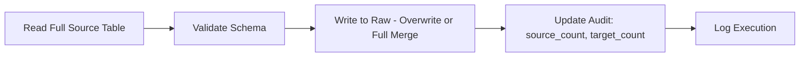
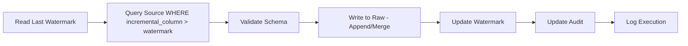
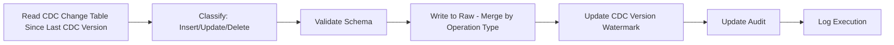

# Ingestion Framework

**Version:** 1.0
**Last Modified:** 2026-07-13
**Depends On:** Project_Architecture.md (v1.0), Medallion_Architecture.md (v1.0), Config_Framework.md (v1.0), Schema_Management_Framework.md (v1.0)
**Category:** Frameworks

## Purpose
Defines the three supported ingestion methods (Full, Incremental, CDC) from SQL Server into the Raw layer — the end-to-end process each method follows, including validation, audit, logging, recovery, and restart behavior. This is the process contract that `Raw_Framework.md` and ingestion-related Components implement.

## Scope
Covers source-to-Raw ingestion logic only. Does NOT cover what happens after data lands in Raw (that's `Raw_Framework.md`) and does NOT cover Silver/Gold processing.

## Supported Load Types

| Load Type | When Used | Key Requirement |
|---|---|---|
| Full Load | Small tables, no reliable incremental column, or first-time load | Full source table read every run; overwrite or full-merge into Raw |
| Incremental Load | Tables with a reliable `modified_date`/`updated_at`-style column | `incremental_column` and `watermark_column` must be set in `Source_Config` |
| CDC Load | Tables with SQL Server CDC/Change Tracking enabled | `cdc_enabled = true` in `Source_Config`; CDC must be enabled at the SQL Server side already |

## Full Load — Process Flow



**Behavior rules:**
- Every run reads the entire source table — no filtering by date/watermark.
- Raw write mode: overwrite (if Raw is meant to always reflect current full state) — this must be explicitly set in `Pipeline_Config` per table, not assumed.
- Idempotency is inherent: re-running produces the same result, since the full table is read each time.

## Incremental Load — Process Flow



**Behavior rules:**
- Watermark value is read from the last successful run's audit record before querying source — never hardcoded.
- Watermark is only advanced AFTER a successful write — if the write fails, the next run retries the same window (this is the restart/recovery mechanism).
- Late-arriving rows with a timestamp older than the current watermark but not previously captured are a known limitation of this method — flagged as an acceptable tradeoff, not silently ignored (documented in `SCD_Type2_Framework.md` under late-arriving records).

## CDC Load — Process Flow



**Behavior rules:**
- Each change row carries an operation type (Insert/Update/Delete); Raw layer must preserve this so Silver can apply the correct merge logic.
- Deletes are never physically removed from Raw — they are recorded as delete-flagged rows (soft delete), preserving full history at the Raw layer.
- CDC version/LSN is the watermark equivalent — tracked the same way as `watermark_column` for incremental loads.

## Common Requirements (All Load Types)

| Requirement | Rule |
|---|---|
| Schema validation | Must run per `Schema_Management_Framework.md` before every write, regardless of load type |
| Audit | Every run captures source count, target count, rejected count (see `Audit_Framework.md`) |
| Logging | Every run logs start time, end time, status, row counts (see `Logging_Framework.md`) |
| Restart/Recovery | A failed run must be safely re-runnable without data duplication or loss — see per-type behavior above |
| Idempotency | Guaranteed differently per load type (full re-read for Full; watermark-gated for Incremental; version-gated for CDC) — but always guaranteed |

## Recovery & Restart Logic (Decision Table)

| Failure Point | Recovery Behavior |
|---|---|
| Failure during source read | Simply re-run; no partial state was written |
| Failure during write (Raw) | Re-run from same watermark/CDC version (not yet advanced); write is transactional per Delta guarantees, so no partial write persists |
| Failure during watermark update | Re-run detects Raw already contains the batch (via `_load_id` audit column) and skips re-write, then just advances the watermark — prevents duplicate writes on retry |

## Best Practices
- Never advance a watermark before confirming the corresponding write succeeded — this single rule is what makes the whole framework restart-safe.
- Always tag every batch with a unique `_load_id` in the audit columns — this is what allows a retry to detect "did this already get written?" without relying on watermark timing alone.

## Validation Rules
- No table config may have `load_type = Incremental` without both `incremental_column` and `watermark_column` populated in `Source_Config`.
- No table config may have `load_type = CDC` without `cdc_enabled = true`.

## Pseudo Logic
```
FUNCTION ingest(table_config):
    load_type = table_config.load_type

    IF load_type == "Full":
        data = READ_FULL(table_config.source)
    ELIF load_type == "Incremental":
        watermark = GET_LAST_WATERMARK(table_config.table_name)
        data = READ_SOURCE(table_config.source, WHERE incremental_column > watermark)
    ELIF load_type == "CDC":
        last_version = GET_LAST_CDC_VERSION(table_config.table_name)
        data = READ_CDC_CHANGES(table_config.source, SINCE last_version)

    validate_schema(table_config.table_name, data.schema)   # per Schema_Management_Framework
    WRITE_RAW(data, mode=determined_by(load_type))
    UPDATE_AUDIT(table_config.table_name, source_count, target_count)
    IF load_type != "Full":
        ADVANCE_WATERMARK(table_config.table_name)   # only after successful write
    LOG_EXECUTION(table_config.table_name, status=SUCCESS)
```

## Acceptance Criteria
- [ ] Each of the three load types has a fully deterministic process flow with no ambiguous steps.
- [ ] Recovery behavior is defined for every failure point, not just the "happy path."
- [ ] Watermark/CDC version advancement is always gated on write success, never advanced speculatively.

## Example Metadata (Illustrative Only)

```yaml
table_name: Orders
load_type: CDC
cdc_enabled: true
primary_keys: [order_id]
```

## Dependencies
- `Project_Architecture.md` (v1.0), `Medallion_Architecture.md` (v1.0) — establishes Raw as the ingestion target and its contract.
- `Config_Framework.md` (v1.0) — reads `load_type`, `incremental_column`, `watermark_column`, `cdc_enabled` fields directly.
- `Schema_Management_Framework.md` (v1.0) — schema validation step is invoked as a gate before every write.

## Future Extension Points
- A streaming ingestion method (fourth load type) could be added here if near-real-time requirements emerge — would need its own process flow section following the same pattern.

## AI Generation Notes
Any agent generating a Raw ingestion notebook must select its process flow based purely on `Source_Config.load_type` — never hardcode which load type a specific table uses inside the notebook logic itself. The notebook should read the config to determine behavior at runtime, or at minimum, the ingestion notebook generated for a table should exactly match the load type declared in its config, not the AI's own assumption.