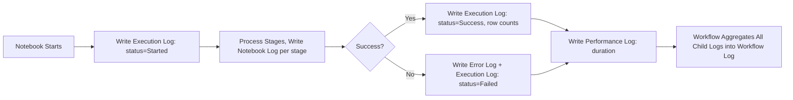

# Logging Framework

**Version:** 1.0
**Last Modified:** 2026-07-13
**Depends On:** Project_Architecture.md (v1.0), Config_Framework.md (v1.0), Ingestion_Framework.md (v1.0), Raw_Framework.md (v1.0), Silver_Framework.md (v1.0), Gold_Framework.md (v1.0)
**Category:** Frameworks

## Purpose
Defines a single, consistent logging model used across every layer (Raw, Silver, Gold) and every execution unit (notebook, workflow). This is what makes execution observable and debuggable across "hundreds of projects" without each pipeline inventing its own logging approach.

## Scope
Covers what gets logged, where it's stored, and the required fields per log type. Does NOT cover audit-specific reconciliation logic (source count vs. target count checks) — that's `Audit_Framework.md`, which consumes some of the same fields but serves a distinct purpose (data integrity vs. operational visibility).

## Log Types

| Log Type | Purpose | Written By |
|---|---|---|
| Execution Log | One row per notebook run — start, end, status, counts | Every notebook, at start and end |
| Notebook Log | Fine-grained step-level detail within a notebook run | Notebook, at each major stage (e.g., "schema validation complete") |
| Workflow Log | One row per workflow run — aggregates all child notebook statuses | Orchestrator, at workflow start/end |
| Error Log | Captures exception details when a failure occurs | Any component, on exception |
| Performance Log | Duration and resource usage per stage | Notebook, at each major stage |

## Central Log Table Schema

| Field | Type | Applies To |
|---|---|---|
| `log_id` | string (UUID) | All log types |
| `pipeline_id` | string | All — links back to the overall pipeline run |
| `workflow_id` | string | Workflow, Notebook, Execution logs |
| `notebook_id` | string | Notebook, Execution logs |
| `table_name` | string | Execution, Notebook logs |
| `log_type` | enum(Execution, Notebook, Workflow, Error, Performance) | All |
| `status` | enum(Started, Success, Failed, Skipped) | Execution, Workflow logs |
| `start_time` | timestamp | Execution, Workflow, Performance logs |
| `end_time` | timestamp | Execution, Workflow, Performance logs |
| `duration_seconds` | integer | Performance logs |
| `row_count_source` | integer | Execution logs |
| `row_count_inserted` | integer | Execution logs |
| `row_count_updated` | integer | Execution logs |
| `row_count_deleted` | integer | Execution logs |
| `row_count_rejected` | integer | Execution logs |
| `error_message` | string, nullable | Error logs |
| `error_stack_trace` | string, nullable | Error logs |
| `message` | string | Notebook logs (free-text step description) |

## Required Logging Points (Per Layer)

| Layer | Required Log Points |
|---|---|
| Raw | Ingestion start, schema validation result, write result (rows written), watermark/CDC version update |
| Silver | Stage-by-stage result (null handling, dedup, business rules, DQ rules), rejected row count, merge result |
| Gold | Dimension key resolution result, fact write result, aggregate refresh result |
| Workflow | Workflow start, each child notebook's status, workflow completion status |

## Flow Diagram



## Best Practices
- Every log write must include `pipeline_id` so a single run can be traced end-to-end across Raw → Silver → Gold, even though those are separate notebooks.
- Never log sensitive data values (actual row contents) in `message` or `error_message` fields — log identifiers, counts, and rule names, not raw business data.
- Use structured logging (consistent field names) rather than free-text log lines wherever possible, so logs remain queryable.

## Validation Rules
- Every notebook execution must produce exactly one Execution Log row with a terminal status (`Success`, `Failed`, or `Skipped`) — never left in `Started` state indefinitely.
- Every Error Log entry must reference a `pipeline_id` and `notebook_id` for traceability.

## Pseudo Logic
```
FUNCTION log_execution_start(table_config, pipeline_id):
    WRITE execution_log(status="Started", start_time=now(), pipeline_id=pipeline_id, table_name=table_config.table_name)

FUNCTION log_execution_end(table_config, pipeline_id, status, counts):
    WRITE execution_log(status=status, end_time=now(), row_count_source=counts.source,
                         row_count_inserted=counts.inserted, row_count_rejected=counts.rejected, ...)
    WRITE performance_log(duration_seconds = end_time - start_time)

FUNCTION log_error(pipeline_id, notebook_id, exception):
    WRITE error_log(error_message=exception.message, error_stack_trace=exception.trace,
                     pipeline_id=pipeline_id, notebook_id=notebook_id)
```

## Acceptance Criteria
- [ ] Every log type has a defined schema with required fields.
- [ ] Every layer (Raw, Silver, Gold) has explicit required logging points.
- [ ] No log entry can reference sensitive row-level business data.
- [ ] Logs are queryable via consistent field names across all log types (no per-table custom fields).

## Example (Illustrative Only)

```
log_id: 8f3a...
pipeline_id: pipe_20260713_001
table_name: Orders
log_type: Execution
status: Success
start_time: 2026-07-13T02:00:00
end_time: 2026-07-13T02:03:12
row_count_source: 15234
row_count_inserted: 120
row_count_updated: 45
row_count_rejected: 2
```

## Dependencies
- `Project_Architecture.md` (v1.0) — logging applies uniformly across the layers defined there.
- `Config_Framework.md` (v1.0) — `pipeline_id`, `workflow_id`, `notebook_id` trace back to `Workflow_Config` entries.
- `Ingestion_Framework.md`, `Raw_Framework.md`, `Silver_Framework.md`, `Gold_Framework.md` (all v1.0) — each defines its own required logging points, consumed here into one unified schema.

## Future Extension Points
- Could integrate with an external observability tool (e.g., Datadog, Azure Monitor) by streaming these log tables, if operational monitoring needs grow beyond querying Delta tables directly.
- Could add log retention/archival rules, similar to Raw's retention policy.

## AI Generation Notes
Any agent generating a notebook must call the shared `Logging_Component` at every required logging point defined in the "Required Logging Points" table above — logging is not optional boilerplate and must not be reinvented per notebook.