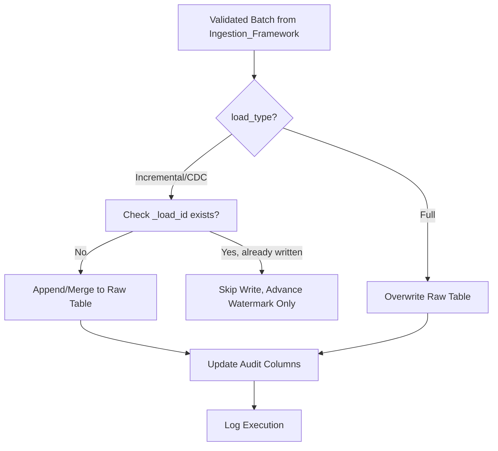

# Raw Framework

**Version:** 1.0
**Last Modified:** 2026-07-13
**Depends On:** Project_Architecture.md (v1.0), Medallion_Architecture.md (v1.0), Config_Framework.md (v1.0), Schema_Management_Framework.md (v1.0), Ingestion_Framework.md (v1.0)
**Category:** Frameworks

## Purpose
Defines how data is physically stored, organized, and maintained once it lands in the Raw layer as Delta tables. `Ingestion_Framework.md` defines *how data gets into* Raw; this document defines what happens to it *once it's there* — table structure, partitioning, optimization, and duplicate prevention.

## Scope
Covers Raw layer Delta table design and maintenance. Does NOT cover the read-from-source logic (that's `Ingestion_Framework.md`) and does NOT cover any cleansing/transformation (that's `Silver_Framework.md` — Raw remains as close to source shape as possible, per the Raw layer contract in `Medallion_Architecture.md`).

## Raw Table Design

| Aspect | Rule |
|---|---|
| Table naming | `raw_{table_name}` (see `Standards/Naming_Standards.md` for full convention) |
| File format | Delta Lake |
| Landing pattern | One Delta table per source table — no combining multiple source tables into one Raw table |
| Required audit columns | `_ingested_at`, `_source_system`, `_load_id`, `_watermark_value`, `_operation_type` (CDC only, values: Insert/Update/Delete) |

## Partitioning Strategy

| Load Type | Recommended Partition Column | Rationale |
|---|---|---|
| Full | None, or `_ingested_at` (date) if table is large | Full loads overwrite; partitioning mainly helps if retaining historical full snapshots |
| Incremental | `_ingested_at` (date) | Enables efficient pruning for time-based queries and retention cleanup |
| CDC | `_ingested_at` (date) | Same as Incremental; also helps isolate a given day's captured changes |

Actual partition column per table is set via `Pipeline_Config.partition_columns` — this table only defines the *default recommendation logic*, not a hardcoded value.

## Optimization

| Practice | When Applied |
|---|---:|
| `OPTIMIZE` with Z-ORDER on merge keys | Scheduled periodically (not every run) — frequency defined in `Workflow_Config` or a maintenance job |
| `VACUUM` | Scheduled periodically, respecting `retention_policy` from `Pipeline_Config` — never run with a shorter retention than declared |
| Auto-compaction | Enabled by default on all Raw Delta tables to avoid small-file problems from frequent incremental/CDC writes |

## Schema Evolution & File Layout
Schema evolution behavior is governed entirely by `Schema_Management_Framework.md` — this document does not duplicate those rules, only confirms that Raw tables must support `mergeSchema` for additive changes as defined there.

## Checkpointing & Idempotency

| Load Type | Idempotency Mechanism |
|---|---|
| Full | Overwrite mode — naturally idempotent, no checkpoint needed |
| Incremental | Watermark-gated read + `_load_id` write-tracking (see `Ingestion_Framework.md` recovery logic) |
| CDC | CDC version/LSN-gated read + `_load_id` write-tracking |

Duplicate prevention relies on the `_load_id` audit column: before writing a batch, check whether a batch with the same `_load_id` (derived from source watermark/version range) already exists in Raw. If so, skip the write and proceed directly to watermark advancement — this handles the "failure after write, before watermark update" recovery case from `Ingestion_Framework.md`.

## Load Tracking & Watermark Handling
Watermark values themselves are stored in `Source_Config` (or a dedicated runtime tracking table referencing it) — not inside the Raw Delta table itself. The Raw table only carries the `_watermark_value` audit column showing what watermark was in effect when each row was written, for traceability.

## Validation Rules
- Every Raw write must include all required audit columns — a write missing `_load_id` or `_ingested_at` fails validation and must not proceed.
- No Raw table may be overwritten with `mode=overwrite` unless `load_type = Full` — using overwrite mode on an Incremental or CDC table is a critical misconfiguration and must be blocked.
- `VACUUM` operations must never use a retention period shorter than the table's configured `retention_policy`.

## Flow Diagram



## Best Practices
- Keep Raw as unopinionated as possible — resist the temptation to add "just one small transformation" here; that logic belongs in Silver, and mixing concerns breaks the layer contract and makes the framework harder to generalize across tables.
- Schedule `OPTIMIZE`/`VACUUM` as separate maintenance workflows, not inline in every ingestion run — keeps ingestion latency predictable.

## Pseudo Logic
```
FUNCTION write_raw(table_config, validated_batch, load_id):
    IF table_config.load_type == "Full":
        WRITE(validated_batch, mode="overwrite")
    ELSE:
        IF EXISTS(raw_table WHERE _load_id == load_id):
            SKIP write
        ELSE:
            WRITE(validated_batch, mode="append_or_merge")
    UPDATE_AUDIT_COLUMNS(table_config.table_name, load_id)
```

## Acceptance Criteria
- [ ] Every Raw table generated includes all required audit columns.
- [ ] Partitioning defaults are documented and traceable to `Pipeline_Config.partition_columns`.
- [ ] Duplicate-write prevention logic (`_load_id` check) is present for Incremental and CDC tables.
- [ ] No transformation logic (cleansing, dedup, casting) appears anywhere in Raw — that's a Silver responsibility.

## Example (Illustrative Only)

```
Table: raw_orders
Partition: _ingested_at (date)
Audit columns: _ingested_at, _source_system, _load_id, _watermark_value, _operation_type
Retention: indefinite (per Pipeline_Config)
```

## Dependencies
- `Medallion_Architecture.md` (v1.0) — Raw layer contract (required audit columns, mutability rules).
- `Config_Framework.md` (v1.0) — reads `partition_columns`, `retention_policy` from `Pipeline_Config`.
- `Schema_Management_Framework.md` (v1.0) — schema evolution rules applied at write time.
- `Ingestion_Framework.md` (v1.0) — supplies the validated batch and load type this framework writes.

## Future Extension Points
- If retention/archival to cold storage becomes a requirement, this document would need a new section on tiered storage (e.g., moving old Raw partitions to cheaper storage after N days).

## AI Generation Notes
Any agent generating a Raw-layer notebook must implement the `_load_id` duplicate-check before every non-Full write, and must never allow `mode=overwrite` for Incremental/CDC tables — this is a hard validation rule, not a style preference.