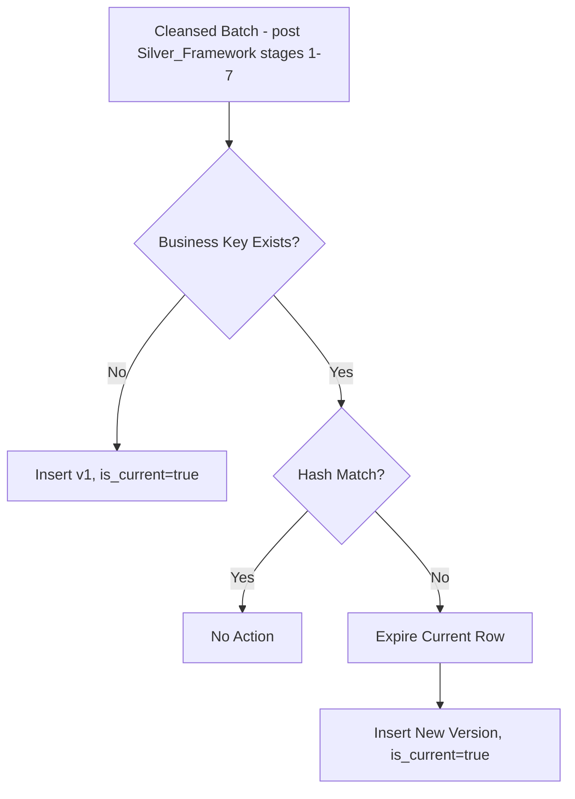

# SCD Type 2 Framework

**Version:** 1.0
**Last Modified:** 2026-07-13
**Depends On:** Project_Architecture.md (v1.0), Medallion_Architecture.md (v1.0), Config_Framework.md (v1.0), Silver_Framework.md (v1.0)
**Category:** Frameworks

## Purpose
Defines how Slowly Changing Dimension Type 2 history tracking works for tables configured with `scd_type = 2`. History is stored alongside the current record in Silver (and mirrored into Gold dimensions); this document defines effective dating, current-flag management, versioning, and merge logic for that history.

## Scope
Covers SCD Type 2 mechanics only. Applies to both Silver (business-conformed history) and Gold (dimension history), per whichever layer's `Pipeline_Config.scd_type = 2`. Does NOT cover the cleansing stages that happen before SCD logic runs (that's `Silver_Framework.md` stages 1–7) — SCD Type 2 is effectively stage 8 (replacing the plain merge) when `scd_type = 2` is configured.

## Core SCD Type 2 Concepts

| Concept | Column | Purpose |
|---|---|---|
| Effective Date | `_effective_date` | When this version of the record became active |
| Expiry Date | `_expiry_date` | When this version was superseded (null/9999-12-31 if current) |
| Current Flag | `_is_current` | Boolean, true only for the currently active version |
| Version Number | `_version` | Incrementing integer per business key, starting at 1 |
| Surrogate Key | `_surrogate_key` | Unique key per version row (differs from business key, which repeats across versions) |
| Business Key | (from `Pipeline_Config.business_keys`) | Identifies the real-world entity across all its versions |

## SCD Type 2 Merge Logic (Decision Table)

| Incoming Row vs. Current Silver Row | Action |
|---|---|
| Business key doesn't exist in Silver yet | Insert new row: `_version = 1`, `_is_current = true`, `_effective_date = now`, `_expiry_date = null` |
| Business key exists, no attribute change (hash match) | No action — row is unchanged |
| Business key exists, attribute changed (hash mismatch) | Expire current row (`_is_current = false`, `_expiry_date = now`); insert new row (`_version = previous + 1`, `_is_current = true`, `_effective_date = now`, `_expiry_date = null`) |
| Business key exists in Silver, missing from incoming batch (deleted at source) | Per `error_handling_strategy` — typically expire the row without inserting a replacement, unless soft-delete tracking is required |

## Hash Comparison
Change detection uses a hash of all tracked (non-key, non-audit) columns, computed and stored as `_row_hash`. Comparing incoming row's computed hash against the current Silver row's `_row_hash` determines whether a change occurred — this avoids column-by-column comparison logic being hardcoded per table.

## Late-Arriving Records
Per the known limitation flagged in `Ingestion_Framework.md`: if a row arrives with an `_effective_date` earlier than an already-processed version's effective date, it is flagged for manual reprocessing rather than automatically inserted out of order — automatic out-of-order insertion risks corrupting the version sequence. This is logged to `Governance/Onboarding_Exceptions_Log.md` when it occurs.

## Reprocessing
Reprocessing (correcting a previously loaded SCD chain, e.g., due to a late-arriving record or a data fix) is a manual-trigger operation, not automatic. It requires:
1. Identifying the affected business key(s).
2. Recomputing the full version chain for those keys from Silver's source history.
3. Re-running the SCD merge logic for just those keys, in isolation, without affecting unrelated business keys.

## Flow Diagram



## Best Practices
- Never mutate history rows in place beyond setting `_is_current` and `_expiry_date` — all other columns of a closed version row are frozen, preserving true point-in-time accuracy.
- Always compute `_row_hash` using the same deterministic column ordering and hash function across all tables — inconsistency here breaks change detection in ways that are hard to debug.

## Validation Rules
- No table may have more than one row with `_is_current = true` per business key at any time — this is a hard invariant, checked as part of DQ rules.
- `_version` numbers must be strictly sequential per business key with no gaps.

## Pseudo Logic
```
FUNCTION apply_scd2(table_config, cleansed_batch):
    FOR each row in cleansed_batch:
        business_key = extract(row, table_config.business_keys)
        incoming_hash = compute_hash(row, table_config.tracked_columns)
        current_row = SELECT * FROM silver_table
                      WHERE business_key = business_key AND _is_current = true

        IF current_row IS NULL:
            INSERT row WITH _version=1, _is_current=true, _effective_date=now, _expiry_date=null

        ELSE IF current_row._row_hash == incoming_hash:
            CONTINUE  # no change

        ELSE:
            UPDATE current_row SET _is_current=false, _expiry_date=now
            INSERT row WITH _version = current_row._version + 1,
                           _is_current=true, _effective_date=now, _expiry_date=null
```

## Acceptance Criteria
- [ ] Every SCD-tracked table maintains exactly one current row per business key at all times.
- [ ] Version numbers are sequential with no gaps or duplicates.
- [ ] Late-arriving records are flagged for manual review rather than silently inserted out of sequence.
- [ ] Hash-based change detection is used consistently, not per-column comparison logic.

## Example (Illustrative Only)

```
business_key: customer_id = 1001

Version 1: effective 2026-01-01, expiry 2026-06-01, is_current=false, address="123 Main St"
Version 2: effective 2026-06-01, expiry null,        is_current=true,  address="456 Oak Ave"
```

## Dependencies
- `Medallion_Architecture.md` (v1.0) — Silver layer's SCD2-related audit columns are defined at the contract level there; this document details the mechanics.
- `Config_Framework.md` (v1.0) — reads `scd_type`, `business_keys` from `Pipeline_Config`.
- `Silver_Framework.md` (v1.0) — this framework's merge stage (stage 8) is replaced by SCD2 logic when `scd_type = 2`.

## Future Extension Points
- Could add SCD Type 1 (overwrite, no history) as an explicit alternate path for tables where `scd_type = 1` — currently only Type 2 is detailed here; Type 1 is implied to be a simple overwrite but could warrant its own subsection later.
- Automated reprocessing (rather than manual-trigger) could be added if late-arriving records become frequent enough to justify the complexity.

## AI Generation Notes
Any agent generating SCD Type 2 merge logic must implement hash-based change detection exactly as described, and must never allow more than one `_is_current = true` row per business key — this invariant should be checked as a post-merge validation step in generated code, not assumed to hold implicitly.