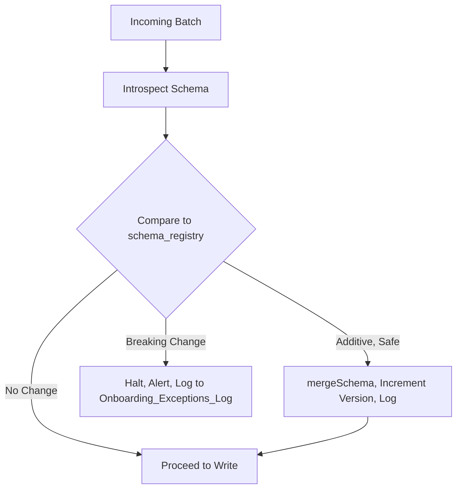

# Schema Management Framework

**Version:** 1.0
**Last Modified:** 2026-07-13
**Depends On:** Project_Architecture.md (v1.0), Medallion_Architecture.md (v1.0), Config_Framework.md (v1.0)
**Category:** Frameworks

## Purpose
Defines how the framework handles schema — evolution, drift detection, validation, and versioning — as *behavior*, applicable uniformly to every table. Per our earlier discussion: this document owns the *rules*; actual per-table column definitions live in config/metadata, never here.

## Scope
Covers schema validation logic, evolution policy, drift handling, and schema versioning strategy. Does NOT contain any actual table's column list — that would violate the no-hardcoding principle established in `Project_Architecture.md`.

## Schema Handling Principles

| Principle | Rule |
|---|---|
| Source of truth | The source system's live schema (introspected at runtime) is authoritative, not a stored copy, unless explicitly cached for performance |
| Evolution policy | Additive changes (new nullable columns) are auto-accommodated; type changes and column removals are NOT auto-accommodated |
| Drift detection | Every Raw load compares incoming batch schema against the last known schema before writing |
| Versioning | Each detected schema change increments a `schema_version` value, tracked per table |

## Schema Evolution Decision Table

| Change Type | Auto-Handled? | Action |
|---|---|---|
| New nullable column added | Yes | Add column to Delta table via schema evolution (`mergeSchema`), increment `schema_version`, log the change |
| New non-nullable column added | No | Halt ingestion for that table, alert, require manual config review |
| Column removed from source | No | Halt ingestion, alert — do not silently drop from Raw |
| Column type changed (widening, e.g., int → bigint) | Yes, if safe per Delta type-widening rules | Auto-accommodate, log, increment `schema_version` |
| Column type changed (narrowing or incompatible) | No | Halt ingestion, alert, require manual review |
| Column renamed at source | No | Treated as remove + add; halts ingestion (renames cannot be distinguished automatically from drop+add) |

## Where Schema Definitions Actually Live

| Concern | Location |
|---|---|
| Behavior rules (this document) | `specs/Frameworks/Schema_Management_Framework.md` — static, applies to all tables |
| Actual per-table column list | NOT stored in markdown. Either introspected live from SQL Server at runtime, or stored in a `Schema_Config` / `Column_Metadata` Delta table if caching is needed for performance |
| Last-known schema snapshot (for drift comparison) | A Delta table, e.g., `schema_registry`, storing `table_name`, `schema_version`, `column_definitions` (as JSON), `captured_at` |

## Flow Diagram



## Best Practices
- Always log schema changes, even auto-accommodated ones — silent evolution without an audit trail defeats the purpose of the Audit Framework.
- Prefer failing loudly on ambiguous changes (renames, type narrowing) over guessing — a halted pipeline is recoverable; silently corrupted Silver/Gold data is not.

## Validation Rules
- No Raw write may proceed if a breaking schema change is detected, regardless of `error_handling_strategy` set in `Validation_Config` — schema breaks are always `Halt`, this is not configurable per table.
- Every schema change (accommodated or not) must produce a log entry with old schema, new schema, and detected diff.

## Pseudo Logic
```
FUNCTION validate_schema(table_name, incoming_schema):
    last_known = SELECT column_definitions FROM schema_registry WHERE table_name = table_name
    diff = COMPARE(incoming_schema, last_known)

    IF diff.is_empty:
        RETURN PASS

    IF diff.only_additive_nullable_columns:
        APPLY mergeSchema
        INCREMENT schema_version
        LOG diff
        RETURN PASS

    IF diff.has_removed_or_renamed_or_narrowed:
        LOG diff to Onboarding_Exceptions_Log
        ALERT
        RETURN HALT
```

## Acceptance Criteria
- [ ] Every schema change type in the decision table has a defined, deterministic action (no ambiguous "it depends" cases).
- [ ] Drift detection logic can be implemented without needing any hardcoded column list.
- [ ] Halting behavior for breaking changes is non-configurable (safety over convenience).

## Example (Illustrative Only)

```
Detected diff for table "Orders":
  + column added: discount_code (nullable string)   → Auto-accommodated, schema_version 3 → 4
  ~ column type changed: order_id (int → varchar)   → Breaking change, HALT, alert sent
```

## Dependencies
- `Project_Architecture.md` (v1.0) — establishes SQL Server as source, Delta as storage (relevant to which schema evolution rules apply, e.g., Delta's `mergeSchema` behavior).
- `Medallion_Architecture.md` (v1.0) — schema validation is the gate between Raw and Silver per the layer promotion rules.
- `Config_Framework.md` (v1.0) — this document does not introduce new config fields but assumes `Source_Config.table_name` as the join key for schema registry lookups.

## Future Extension Points
- If a second source system type is added, this framework would need per-source-type schema introspection logic (SQL Server introspection differs from, say, a REST API's schema).
- Could add automated schema-diff notifications to a Slack/Teams channel via `Notification_Component.md`.

## AI Generation Notes
Any agent generating Raw ingestion notebooks must include a schema validation step per the Pseudo Logic above, before the write operation — this is not optional boilerplate, it's a required gate per `Medallion_Architecture.md`'s promotion rules.