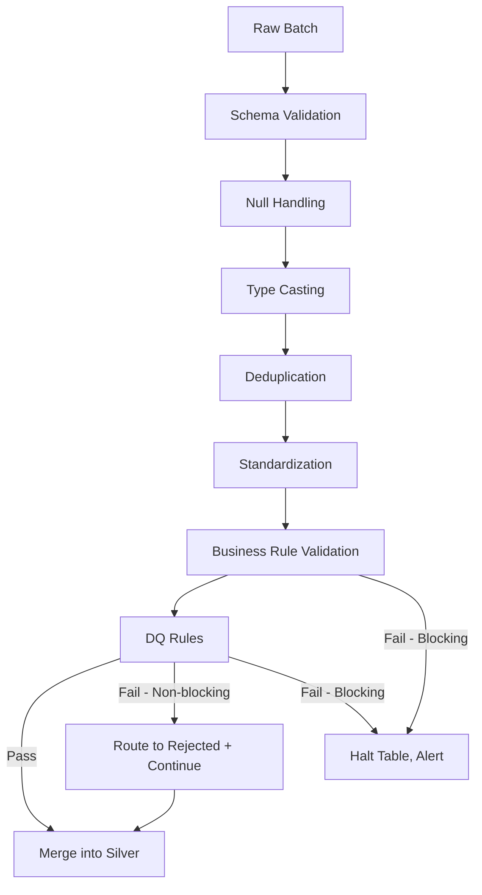

# Silver Framework

**Version:** 1.0
**Last Modified:** 2026-07-13
**Depends On:** Project_Architecture.md (v1.0), Medallion_Architecture.md (v1.0), Config_Framework.md (v1.0), Schema_Management_Framework.md (v1.0), Raw_Framework.md (v1.0)
**Category:** Frameworks

## Purpose
Defines how data is transformed from Raw into Silver — cleansing, deduplication, standardization, validation, and business rule enforcement — producing the "latest valid record" per the Silver layer contract in `Medallion_Architecture.md`. History tracking (SCD Type 2) is covered separately in `SCD_Type2_Framework.md`; this document covers the cleansing/validation stage that precedes it.

## Scope
Covers data quality processing between Raw and Silver. Does NOT cover history/versioning logic (that's `SCD_Type2_Framework.md`) and does NOT cover dimension/fact modeling (that's `Gold_Framework.md`).

## Silver Processing Pipeline (Ordered Stages)

| Stage | Purpose | Failure Behavior |
|---|---|---|
| 1. Schema Validation | Confirm incoming Raw batch matches expected structure | Halt (per `Schema_Management_Framework.md`) |
| 2. Null Handling | Apply configured null-handling strategy per column | Row rejected if a non-nullable field is null and no default is configured |
| 3. Type Casting | Cast Raw's landed types to Silver's business types | Row rejected if cast fails |
| 4. Deduplication | Remove duplicate rows within the batch and against existing Silver data | N/A — dedup always resolves to one row, never fails |
| 5. Data Standardization | Normalize formats (e.g., trim whitespace, standardize casing, date formats) | N/A — always succeeds, deterministic transform |
| 6. Business Rule Validation | Apply table-specific business rules from `Validation_Config.validation_rules` | Row rejected or table halted depending on `error_handling_strategy` |
| 7. Data Quality Rules | Apply `Validation_Config.dq_rules` | Row rejected (non-blocking) or table halted (blocking), per rule severity |
| 8. Merge into Silver | Upsert accepted rows using `merge_keys` from `Pipeline_Config` | N/A |

## Null Handling Strategy (Decision Table)

| Column Nullability | Value Present? | Action |
|---|---|---|
| Nullable | Null | Accept as-is |
| Nullable | Present | Accept as-is |
| Non-nullable | Present | Accept as-is |
| Non-nullable | Null, default configured | Apply default value, log substitution |
| Non-nullable | Null, no default configured | Reject row, log to rejected records |

## Deduplication Rules
- Deduplication key = `merge_keys` from `Pipeline_Config`.
- When duplicates exist within a batch, the row with the latest value in `watermark_column` (or CDC version) wins.
- Deduplication runs both within the incoming batch AND against already-merged Silver data — a re-delivered row from source must not create a duplicate Silver record.

## Rejected vs. Accepted Records
| Record Type | Destination | Rule |
|---|---|---|
| Accepted | Silver target table | Passed all stages 1–7 |
| Rejected (non-blocking DQ failure) | `{table_name}_rejected` table, or a `_dq_status` flag column | Logged with rejection reason; does not halt the batch |
| Rejected (blocking DQ or business rule failure) | Table processing halted entirely | Per `error_handling_strategy = Halt` in `Validation_Config` |

Rejected records must never be silently dropped — always land somewhere queryable, per the Best Practices established in `Medallion_Architecture.md`.

## Data Profiling
Data profiling (row counts, null percentages, distinct value counts, min/max ranges) runs as an informational side process, not a blocking gate. Profiling results are written to a `data_profile_log` and consumed by `Logging_Framework.md` — profiling failures never halt a pipeline, they only inform monitoring.

## Flow Diagram



## Best Practices
- Apply standardization (casing, trimming, date formats) consistently across all tables via shared Components (`Null_Handling_Component`, `Type_Casting_Component`) — never write table-specific one-off logic, since that breaks the "generate code from config" promise.
- Log every rejection with enough detail (which rule, which row identifier, what value) to make root-causing fast — vague rejection logs undermine the entire audit trail.

## Validation Rules
- No row may be merged into Silver without passing schema validation, null handling, and type casting — these three are non-negotiable gates regardless of `error_handling_strategy`.
- Business rule and DQ rule severity (blocking vs. non-blocking) must be explicitly declared per rule in `Validation_Config` — there is no implicit default severity.

## Pseudo Logic
```
FUNCTION process_silver(table_config, raw_batch):
    validate_schema(raw_batch)                     # Halts on failure, no exception
    batch = apply_null_handling(raw_batch, table_config.null_rules)
    batch = apply_type_casting(batch, table_config.type_map)
    batch = deduplicate(batch, table_config.merge_keys, table_config.watermark_column)
    batch = standardize(batch)

    accepted, rejected_business = apply_business_rules(batch, table_config.validation_rules)
    accepted, rejected_dq = apply_dq_rules(accepted, table_config.dq_rules)

    IF any_blocking_failure_detected:
        HALT table_config.table_name
        ALERT
    ELSE:
        WRITE_REJECTED(rejected_business + rejected_dq)
        MERGE_SILVER(accepted, table_config.merge_keys)
        LOG_EXECUTION(table_config.table_name, status=SUCCESS)
```

## Acceptance Criteria
- [ ] All eight processing stages are represented with clear pass/fail behavior.
- [ ] Rejected records always land somewhere queryable — never silently dropped.
- [ ] Deduplication logic correctly handles both intra-batch and cross-batch (existing Silver data) duplicates.
- [ ] Profiling is clearly non-blocking and does not interfere with the pass/fail gates.

## Example Metadata (Illustrative Only)

```yaml
table_name: Orders
merge_keys: [order_id]
null_rules:
  order_id: reject_if_null
  discount_code: default_to_empty_string
validation_rules: [not_null_order_id]
dq_rules:
  - rule: positive_amount_check
    severity: blocking
  - rule: valid_country_code
    severity: non_blocking
```

## Dependencies
- `Medallion_Architecture.md` (v1.0) — Silver layer contract (required audit columns, "latest valid record" definition).
- `Config_Framework.md` (v1.0) — reads `merge_keys`, `validation_rules`, `dq_rules` from `Pipeline_Config`/`Validation_Config`.
- `Schema_Management_Framework.md` (v1.0) — schema validation gate at stage 1.
- `Raw_Framework.md` (v1.0) — supplies the input batch this framework processes.

## Future Extension Points
- Could add configurable data profiling thresholds that escalate to alerts (e.g., "null percentage exceeds 20%") without becoming a blocking gate.
- Could support pluggable custom business rule functions beyond the standard rule library, if table-specific logic genuinely can't be generalized.

## AI Generation Notes
Any agent generating a Silver notebook must implement all eight stages in the exact order listed, using the shared Components (`Null_Handling_Component`, `Dedup_Component`, `Type_Casting_Component`, etc.) rather than inlining custom logic per table. Rule severity (blocking/non-blocking) must be read from config, never assumed.