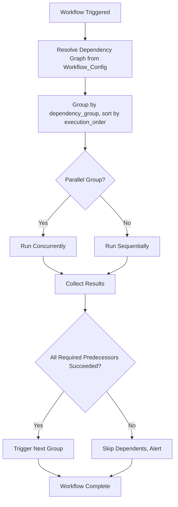

# Workflow Orchestration Framework

**Version:** 1.0
**Last Modified:** 2026-07-13
**Depends On:** Project_Architecture.md (v1.0), Config_Framework.md (v1.0), Medallion_Architecture.md (v1.0), Gold_Framework.md (v1.0), Error_Handling_Framework.md (v1.0), Logging_Framework.md (v1.0), Audit_Framework.md (v1.0)
**Category:** Frameworks

## Purpose
Defines how execution is sequenced across all tables and layers — sequential, parallel, and mixed execution, dependency graph resolution, restart/recovery at the workflow level, and how the `orchestrator_agent` (defined later in `/agents/`) should behave. This is the final piece tying together every other Framework into an actual runnable pipeline.

## Scope
Covers orchestration/sequencing logic only. Does NOT redefine per-layer processing (Raw/Silver/Gold logic already defined) or per-row error handling (already in `Error_Handling_Framework.md`) — this document is about *ordering and triggering*, not *what happens inside* each step.

## Execution Modes

| Mode | Description | When Used |
|---|---|---|
| Sequential | Table B waits for Table A to fully complete | Table B depends on Table A's output (e.g., Gold fact depends on Gold dimension) |
| Parallel | Tables run simultaneously | Tables share no dependency and are grouped under the same `parallel_group` |
| Mixed | Some tables sequential, others parallel, within the same workflow | Most realistic workflows — e.g., all dimensions run in parallel, then all facts run in parallel, but dimensions-as-a-group precede facts-as-a-group |
| Conditional | A step only runs if a prior condition is met | E.g., only run Gold aggregate rebuild if Silver reported new rows since last run |

## Dependency Graph Resolution

Execution order is derived entirely from `Workflow_Config` fields — never hardcoded:

| Field | Role in Ordering |
|---|---|
| `dependency_group` | Logical grouping of related tables (e.g., "Sales") |
| `execution_order` | Order within a dependency group |
| `parallel_group` | Tables sharing this value within a group may run concurrently |
| `execution_sequence` | Global override for strict cross-group ordering, if required |

**Resolution algorithm (high level):**
1. Group tables by `dependency_group`.
2. Within each group, sort by `execution_order`.
3. Tables with the same `execution_order` AND same `parallel_group` run concurrently.
4. Respect the Medallion layer order as an implicit constraint: no table's Silver processing may begin before its own Raw completes; no Gold dimension may begin before its Silver completes; no Gold fact may begin before its referenced dimensions complete (per `Gold_Framework.md`'s dimension-before-fact rule).

## Workflow Groups (Decision Table)

| Group Example | Contains | Execution Pattern |
|---|---|---|
| Sales | Orders (Raw→Silver→Gold), Customers (Raw→Silver→Gold), fact_sales | Dimensions parallel, then fact_sales sequential after |
| Inventory | Inventory (Raw→Silver→Gold) | Independent of Sales group, can run in parallel with it if no shared dependency |

## Failure Recovery & Restart (Workflow-Level)

| Scenario | Recovery Behavior |
|---|---|
| One table in a parallel group fails | Other tables in the group continue (unless their `error_handling_strategy` cascades); failed table follows `Error_Handling_Framework.md` |
| A dependency's failure blocks downstream tables | Downstream tables are marked `Skipped` (not attempted), alert lists them explicitly, per `Error_Handling_Framework.md` |
| Entire workflow run fails mid-way | Workflow is restartable from the point of failure — already-succeeded tables are not re-run (checked via their own Execution Log status), only failed/skipped tables re-attempt |

## Execution Windows
- Each workflow has a defined schedule (`Workflow_Config.schedule`, cron format).
- If a workflow run is still executing when its next scheduled trigger fires, the new trigger is queued or skipped (configurable per workflow) — never allowed to run concurrently with itself, to avoid double-processing the same watermark window.

## Flow Diagram



## Best Practices
- Never hardcode execution order inside a notebook or workflow JSON — always resolve it from `Workflow_Config` at trigger time, so reordering is a config change, not a redeployment.
- Keep `dependency_group` scoped to genuinely related tables (e.g., a business domain like "Sales") rather than one giant group for the whole project — this maximizes safe parallelism.

## Validation Rules
- No table may have a Gold-layer `execution_order` earlier than its own Silver-layer `execution_order`.
- No fact table's `execution_order` may be equal to or earlier than any dimension it references, within the same `dependency_group`.
- A workflow must never trigger a new run while a previous run of the same workflow is still active.

## Pseudo Logic
```
FUNCTION orchestrate_workflow(workflow_name):
    tables = SELECT * FROM Workflow_Config WHERE workflow_name = workflow_name
    groups = GROUP_BY(tables, dependency_group)

    FOR each group in groups (ordered):
        subgroups = GROUP_BY(group.tables, execution_order)
        FOR each subgroup in subgroups (ordered):
            parallel_batches = GROUP_BY(subgroup.tables, parallel_group)
            FOR each batch in parallel_batches:
                RUN_CONCURRENTLY(batch.tables)
            IF any table in subgroup FAILED:
                MARK downstream dependents as SKIPPED
                ALERT(skipped_list)
                CONTINUE to next independent group (if any)
    LOG workflow_completion_status
```

## Acceptance Criteria
- [ ] Execution order is fully derivable from `Workflow_Config` with no hardcoded sequencing.
- [ ] Dimension-before-fact ordering is enforced as a validation rule, not just a convention.
- [ ] Workflow restart logic correctly skips already-succeeded tables and only re-attempts failed/skipped ones.
- [ ] Concurrent runs of the same workflow are prevented.

## Example (Illustrative Only)

```
workflow_name: Sales_Pipeline
dependency_group: Sales
  execution_order 1, parallel_group 1: Customers (Raw→Silver→Gold Dimension)
  execution_order 1, parallel_group 1: Products (Raw→Silver→Gold Dimension)
  execution_order 2, parallel_group 1: fact_sales (Gold Fact, depends on both dimensions above)
```

## Dependencies
- `Config_Framework.md` (v1.0) — reads all `Workflow_Config` fields.
- `Medallion_Architecture.md` (v1.0), `Gold_Framework.md` (v1.0) — layer ordering and dimension-before-fact constraints.
- `Error_Handling_Framework.md` (v1.0) — failure response within an orchestrated run.
- `Logging_Framework.md` (v1.0), `Audit_Framework.md` (v1.0) — workflow-level log/audit aggregation.

## Future Extension Points
- Could add dynamic parallelism (auto-determine safe parallel groups from the dependency graph rather than requiring manual `parallel_group` assignment) as the framework matures.
- Could add cross-workflow dependencies (Workflow B waits on Workflow A) if projects grow beyond single-domain workflows.

## AI Generation Notes
The `orchestrator_agent` (defined in `/agents/orchestrator_agent.md`) is the primary consumer of this framework — it must implement the dependency graph resolution algorithm exactly as described, and must never allow a fact table to be triggered before its referenced dimensions have succeeded.